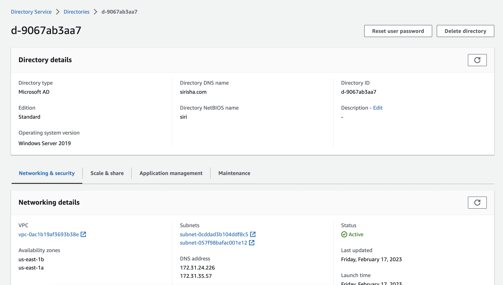
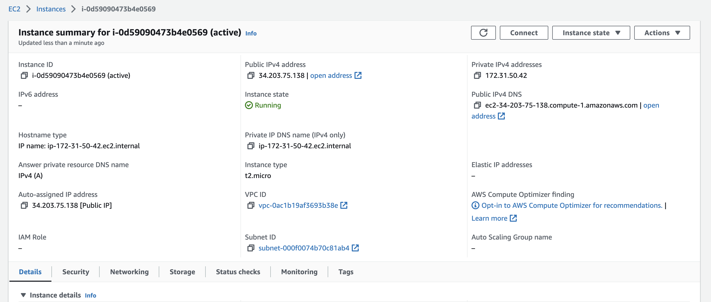
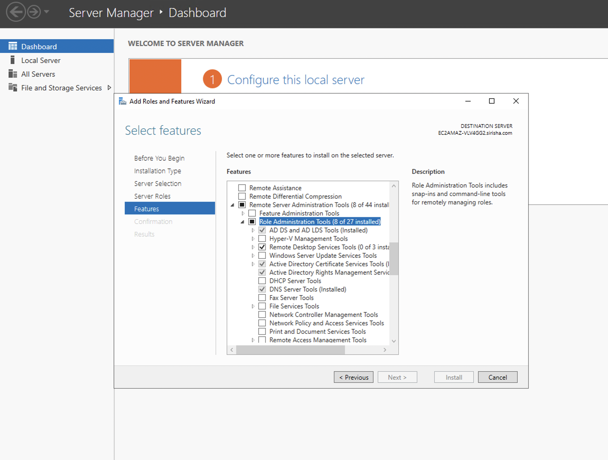
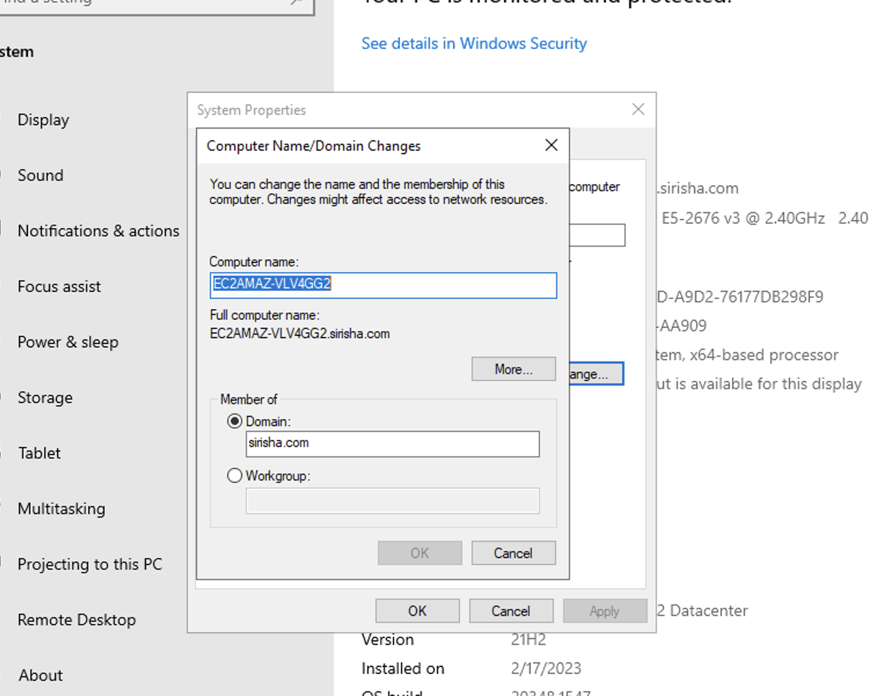
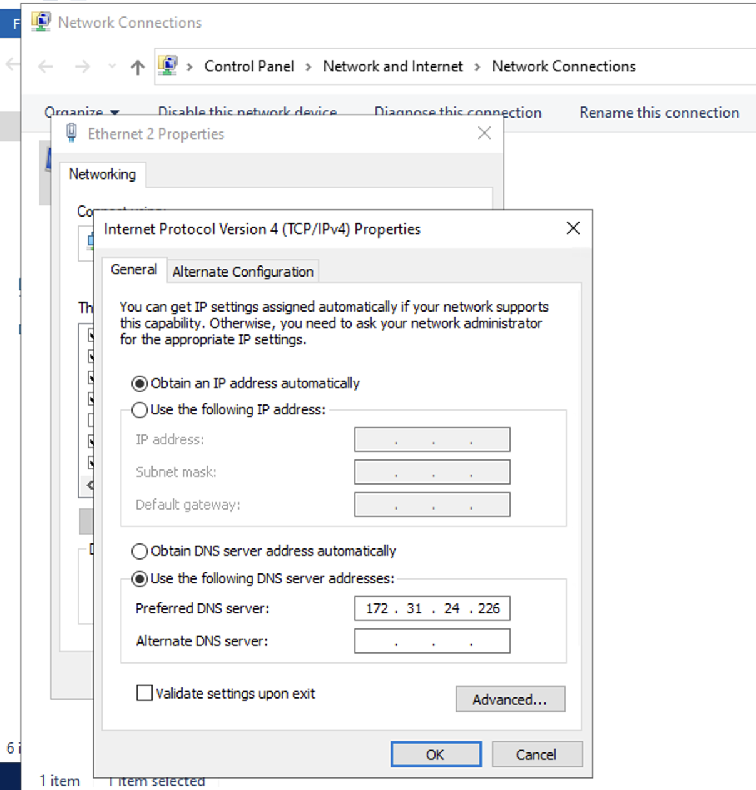
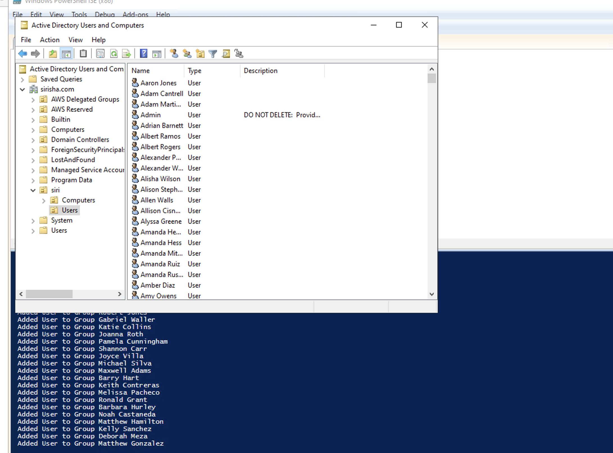
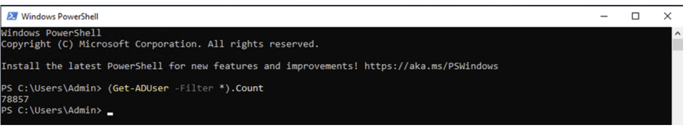

# cmpe282_homework1_active_directory

### Steps:

### Step 1: Set up AWS managed active directory on directory service.
```
- Input Directory DNS Name.
- Provide Admin Password for Active Directory.
- Select the VPC and host subnets in different availability zones.
 ```
 
 
### Step 2: Lanch EC2 instance with microsoft Os image
 ```
- Connect to Microsoft EC2 Instance.
- Set DNS address of Directory Service created in AWS, inside Internet Protocol(TCP/IPv4) Properties.
- Set the Domain name of Directory Service
- Install all the active directory domain feature 
- Now we are connected to our created Active Directory i.e “sirisha.com”
 ```




 
### Step 3: Import Users in AD from large dataset
```
- Used Faker to Generate the Data for User Names
- Then use a PowerShell script to add the user data one at a time to Active Directory
```



### Step 4: Checking Number of User in the Active Directory



 
